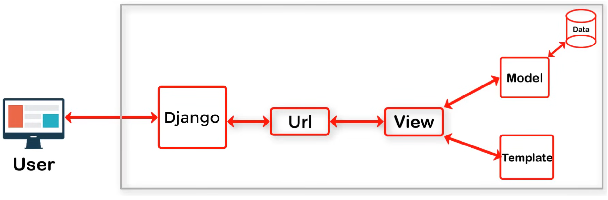

# <samp>Saberes previos sobre Django</samp>
Django sigue el Model View Template (MVT)



# :wrench: <samp>Configuraciones previas</samp>
Para probar la funcionalidad de los programas, debe de realizar los siguientes pasos que están como recordatorio.

> Instalamos django en nuestra maquina o en nuestro entorno de python
```sh
pip install django
```

> Verificamos la version instalada
```sh
pip list
pip show Django

# También podemos usar
django-admin --version
```

## :elephant: <samp>Instalando PostgreSQL</samp>
Ahora, especificamente para el proyecto de `Destinos turísticos` se está usando el sistema de gestión de base de datos relacionales PostgreSQL, por lo tanto es necesario instalar este programa para poder probar dicho proyecto.

> Instalar PostgreSQL en Linux con el gestor de paquetes `pacman`
```sh
sudo pacman -S postgresql
```

En distribuciones Debian como ubuntu, el `cluster` de la base de datos se inicia manualmente, sin embargo en distribuciones como Arch se tiene que hacer manualmente.

> Cambiamos al usuario `postgres` y usamos el comando `initdb`
```sh
su -i -u postgres
initdb --locale=C.UTF-8 --encoding=UTF8 -D /var/lib/postgres/data
```
Ahora podemos aprovechar configurar una constraseña para el superusuario de PostgreSQL, por defecto, como hemos visto, el superusuario es `postgres`.

> Establecer una contraseña para el superusuario, constraseña que se usará para acceder a la base de datos `destinos_turisticos` del progrma `Destinos turisticos`.

```sh
ALTER USER postgres WITH PASSWORD 'jorghee';
```

Con estas configuraciones, estamos listos para iniciar el demonio de PostgreSQL

> Iniciamos el servicio PostgreSQL (demonio)
```sh
sudo systemctl start postgresql
```

Si no hemos obtenido ningún error, entonces podemos continuar con la instalacion (opcional) de una interfaz grafica que nos permite manejar la base de datos, `pgAdmin`.

## <samp>Instalando pgAdmin</samp>
Se recomienda seguir las indicaciones de la pagina oficial de [pgAdmin](https://www.pgadmin.org/), en esta oportunidad se esta usando `pgAdmin4` como un paquete de Python, para obtener más información visita [pgAdmin 4 Python](https://www.pgadmin.org/download/pgadmin-4-python/)

> Resumen de los comandos
```sh
sudo mkdir /var/lib/pgadmin
sudo mkdir /var/log/pgadmin
sudo chown $USER /var/lib/pgadmin
sudo chown $USER /var/log/pgadmin

# Ya dentro del entorno virtual
pip install pgadmin4
```

Ahora podemos acceder al servidor del superusuario `postgres`, esto lo podemos hacer directamente usando pgadmin4. 

- Usuario: postgres
- Contraseña: jorghee
- Host: localhost (127.0.0.1)

Por el momento vamos a crear una nueva base de datos necesaria para el programa `Destinos turisticos`, la nombramos `destinos_turisticos`

Finalmente, debemos de instalar el `Driver` que se encarga de hacer la conexion entre Python y el sistema de gestion de base de datos PostgreSQL.

> Instalar psycopg2 
```sh
pip install psycopg2
```

---
Una vez culminado la instalación de los programas y las configuraciones necesarias, podemos clonar este repositorio

> Clonando el repositorio por el protocolo HTTPS

```sh
git clone https://github.com/jorghee/django-projects.git
```

# :spiral_notepad: <samp>Sistema de notas</samp>
Ya hemos creado un proyecto en Django que lo nombramos `University`. Dentro de este proyecto hemos creado una app que la nombramos `grades`. Solo se necesita realizar las migraciones para probar el programa.

> Realizar las migraciones en la base de datos
```sh
python manage.py makemigrations grades
python manage.py migrate
```

> Lanzamo el servidor para probar el proyecto
```sh
python manage.py runserver
```
Si no ha obtenido ningún error, puede ingresar la url que le sugiere en la descripcion del inicio del servidor desde su navegador de preferencia.

# :airplane: <samp>Destinos turisticos</samp>
Se ha creado otro proyecto en este repositorio, el cual se ha nombrado como `turismo_Peru`, dentro de este proyecto se ha creado una aplicación denominada `destinos_turisticos`, entonces como se mencionó anteriormente se necesita tambien necesitamos modificar la estructura de la base datos.

> Realizar las migraciones en la base de datos
```sh
python manage.py makemigrations destinos_turisticos
python manage.py migrate
```
Luego nuevamente iniciamos el servidor pero para este proyecto y espero que no haya tenido ningún error.

## :eyes: <samp>Lógicas importantes</samp>
